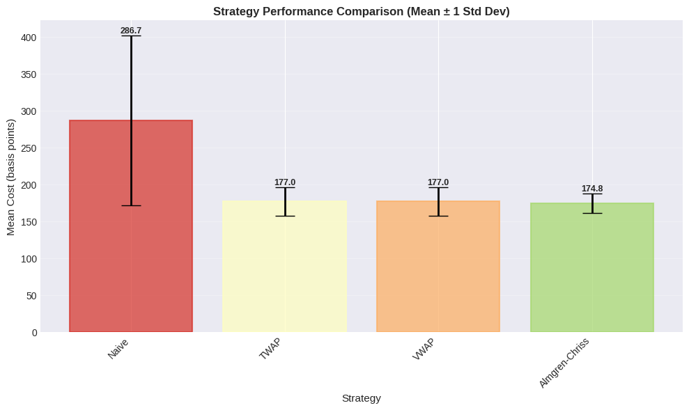
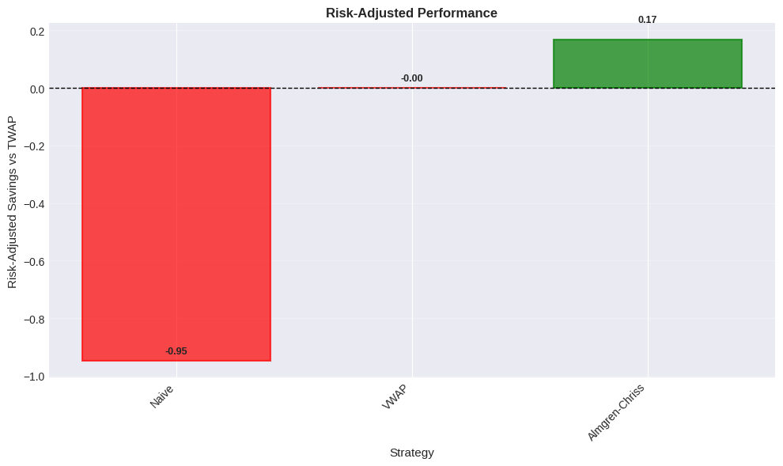
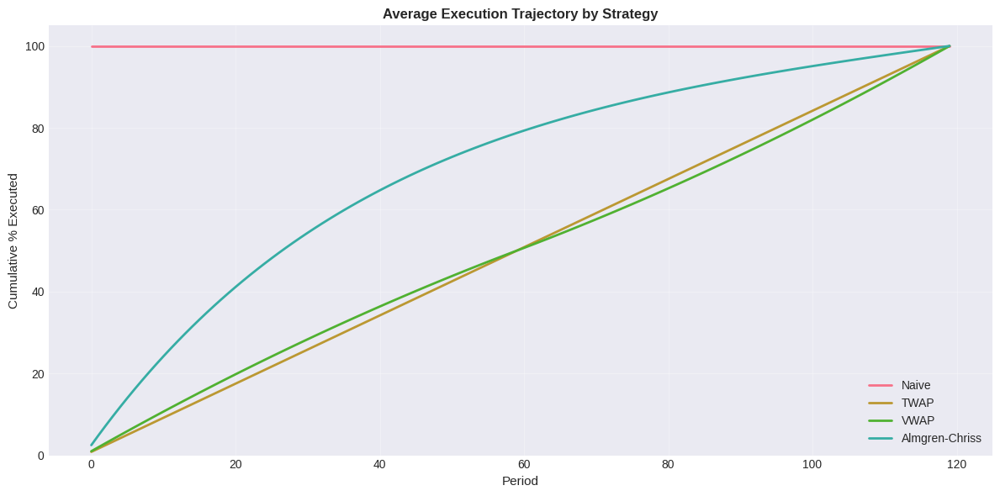
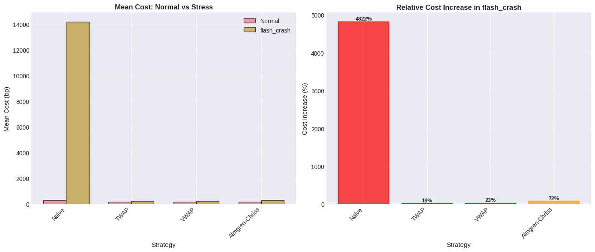
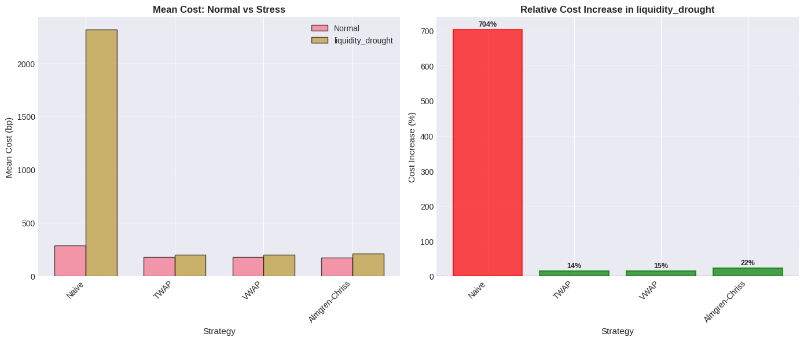
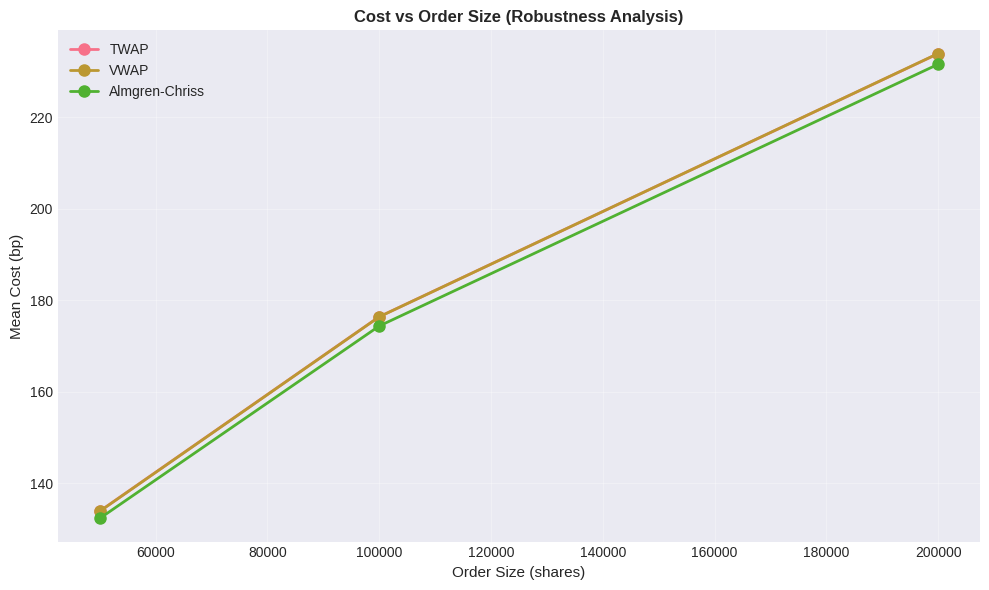

# Almgren-Chriss Optimal Execution Under Mean-Reverting Prices and Stochastic Volatility

## Project Overview

The primary motivation of this project is to assess how **Almgren–Chriss optimal execution** performs in a mean-reverting Ornstein–Uhlenbeck price process with stochastic volatility, as opposed to the arithmetic Brownian motion (ABM) assumptions that underly its original derivation. This project uses a **five-component execution cost decomposition** framework to evaluate execution strategies. 

Execution cost modelling is vital in institutional trading systems where large orders must be executed over time to minimise market impact, slippage, and opportunity cost. While theoretical models often assume simplified dynamics (constant volatility, linear impact, no mean reversion), in reality markets exhibit regime-dependent liquidity, stochastic volatility, and short-term price reversion. This project bridges that gap by simulating execution under more realistic conditions and decomposing total cost into interpretable components: **spread cost, temporary impact, permanent impact, implementation shortfall, and adverse selection**.

## Key Features

- **Mean-reverting price dynamics with stochastic volatility**  
  Price evolves according to a mean-reverting Ornstein–Uhlenbeck process with Heston-style volatility. This captures the short-term mean reversion and volatility clustering that is observed in real markets, providing a more realistic alternative to ABM assumptions.

- **Microstructure-aware market simulation**  
  Includes order flow-dependent spreads, depth depletion under participation, U-shaped intraday volume patterns, and regime detection. Liquidity varies dynamically based on volatility, volume, and execution pressure.

- **Five-component execution cost decomposition**  
  Total cost is decomposed into:
  - **Spread cost**: half-spread paid on each trade
  - **Temporary market impact**: instantaneous price impact with exponential decay
  - **Permanent market impact**: lasting price shift from information revelation
  - **Implementation shortfall**: opportunity cost from VWAP vs arrival price
  - **Adverse selection**: post-trade drift indicating information leakage

- **TWAP (Time-Weighted Average Price) execution**  
  This startegy uniformly distributes order size across execution periods it serves as a baseline that ignores volume patterns and market conditions.

- **VWAP (Volume-Weighted Average Price) execution**  
  This strategy matches forecasted intraday volume profile. Relative execution contcentartion to market liquidity, which follows a U-shaped pattern with higher liquidity at open/close.

- **Almgren–Chriss optimal execution**  
  This strategy solves the mean-variance trade-off between execution cost and risk. Implements the closed-form solution with user-specified urgency parameter ($κT$), it front loads execution to reduce opportunity cost at the expense of higher temporary impact.

- **Stress testing and regime-dependent analysis**  
  This project injects market scenarios (flash crash, momentum drift, liquidity drought) to evaluate strategy robustness. Regime detection classifies market states by volatility, spread, and volume for conditional performance analysis.

- **Monte Carlo simulation framework**  
  Runs thousands of execution paths with perturbed market parameters (volatility, spread, depth). Provides distributional cost statistics, confidence intervals, and risk-adjusted performance metrics (Risk-adjusted savings benchmarked against TWAP, similar to a Sharpe Ratio).

## Quantitative Theory

### Market Simulation Model

#### Price Dynamics

The mid-price $S_t$ evolves according to an **Ornstein–Uhlenbeck (OU) process**:

$$dS_t = \kappa (\theta - S_t)\, dt + \sigma_t S_t \, dW_t$$

where:
- $\kappa$ is the mean-reversion speed (set to 0.5 per minute)
- $\theta$ is the long-term mean price (initialized at S_0)
- $\sigma_t$ is time-varying volatility (stochastic)
- $W_t$ is a standard Brownian motion

This provides a contrast to the ABM assumption $dS_t = \mu \, dt + \sigma \, dW_t$ used in Almgren–Chriss, introducing **mean reversion** that penalises strategies assuming persistent drift.

#### Stochastic Volatility

Volatility follows a **Heston-style square-root process**:

$$dv_t = \kappa_v (\theta_v - v_t)\, dt + \sigma_v \sqrt{v_t}\, dW_v$$

where $v_t$ is instantaneous variance, $θ_v$ is long-run variance, and $\kappa_v$ controls mean reversion. This captures **volatility clustering** and regime transitions, allowing the simulator to model periods of abnormal turbulence (e.g., flash crashes) without exogenous shocks.

#### Order Flow and Liquidity

- **Intraday volume pattern**: Expected volume follows a U-shaped curve, peaking at open/close:

  $$V(t) = ADV · (1 + |t/T - 0.5|) / T$$

  where T = 390 minutes and ADV is average daily volume.

- **Spread dynamics**: The bid-ask spread widens with volatility and participation rate:

$$\text{spread}_t = \text{base spread} \cdot \left( 1 + 1.5 \cdot \frac{\sigma_t}{\bar{\sigma}} \right) \cdot \left( 1 + 0.5 \cdot \frac{q_t}{V_t} \right)$$

where $q_t$ is trade size and $V_t$ is expected volume.

- **Depth depletion**: Limit order book depth decreases with participation:

  $$\text{depth}_t = \text{base depth} / (1 + 0.5 · q_t/V_t)$$

These features introduce **non-linear costs** and **liquidity feedback** which is absent in classical models.

#### Regime Detection

Market state is classified by volatility, spread, and volume percentiles (low/medium/high) over a rolling 20-period window. This enables conditional performance analysis that is dependent on the market state.

---

### Execution Cost Decomposition

Total execution cost is decomposed into five components:

#### 1. Spread Cost

The cost of crossing the bid-ask spread:

$$C_{\text{spread}} = \sum_t \frac{1}{2}\, s_t \, \lvert q_t \rvert$$

where $s_t$ is the spread and $q_t$ is shares traded at time t. This is unavoidable in limit order markets.

#### 2. Temporary Market Impact

Instantaneous price impact that decays exponentially:

$$C_{\text{temp}} = \sum_t\gamma \left( \frac{|q_t|}{V_t} \right)^{\alpha} \sigma_t S_t |q_t|\ e^{-\lambda (T - t)}$$

where:
- $\gamma$ is a dimensionless scaling parameter
- $\alpha \in (0, 1)$ controls concavity (typically 0.5–0.6 from empirical studies)
- $\lambda = \frac{\ln(2)}{t_{1/2}}$ is the decay rate (half-life $t_{1/2}$ = 10 periods)

This formulation assumes **power-law impact** in participation rate and **exponential decay** rather than instant reversal, aligning with empirical microstructure findings.

#### 3. Permanent Market Impact

Lasting price shift from information revelation (Kyle model intuition):

$$C_{\text{perm}} = \eta \left( \frac{Q}{\mathrm{ADV}} \right)^{\beta} S_0 \, Q$$
where:
- $Q = \sum_t q_t$ is total order size
- $\eta$ is permanent impact scaling
- $\beta \in (0, 1)$ controls concavity (set to 0.42, consistent with large-sample empirical estimates)

Permanent impact persists beyond execution and represents the price discovery cost of trading.

#### 4. Implementation Shortfall (Opportunity Cost)

Measures slippage from arrival price to VWAP:
$$C_{\text{opp}} = \max \bigl( 0,\; (\mathrm{VWAP} - S_0)\, Q \bigr)$$

where $S_0$ is the arrival price. This captures **opportunity cost** from delayed execution when price moves adversely.

#### 5. Adverse Selection

Post-trade drift from VWAP to final price:
$$C_{\text{adv}} = \max \bigl( 0,\; - (S_T - \mathrm{VWAP})\, Q \bigr), \qquad \text{(buys)}$$

This isolates **information leakage** costs: if price reverts after execution, the trader may have been adversely selected by informed counterparties. In the OU process with mean reversion, this is mechanically non-zero.

### TWAP and VWAP Execution Strategies

#### TWAP (Time-Weighted Average Price)

TWAP executes a fixed quantity per period:
$$q_t = \frac{Q}{T}, \qquad \forall\, t \in \{1, \ldots, T\}$$

**Rationale**: Minimises timing risk by ignoring market conditions. Widely used as a **benchmark** in execution analysis due to its simplicity and neutrality to intraday patterns.

**Limitations**: Ignores volume patterns, leading to high temporary impact during low-liquidity periods (e.g., mid-day).

#### VWAP (Volume-Weighted Average Price)

VWAP matches the forecasted volume profile:
$$q_t = Q \cdot \frac{V_t}{\sum_i V_i}$$

where $V_t$ is expected volume at time t.

**Rationale**: Aligns execution with liquidity, reducing temporary impact by trading more when the market is thick. VWAP is the execution price a passive trader would achieve by submitting a proportional market order at each period.

**Volume-matching vs scheduled VWAP**: This implementation uses **scheduled VWAP** (pre-specified volume forecast), not adaptive VWAP (responding to realised volume). Scheduled VWAP cannot react to unexpected volume spikes but avoids adverse selection from volume-timing.

### Almgren–Chriss Optimal Execution

#### Optimisation Problem

Almgren–Chriss solves:
$$\min \; \mathbb{E}[C] + \lambda \mathrm{Var}[C]$$

subject to $\sum_t q_t = Q$, where:
- E[C] is expected execution cost (linear + quadratic impact)
- Var[C] is cost variance from price uncertainty
- λ is risk aversion

The closed-form solution is:
$$X_t = X_0 \frac{\sinh\!\bigl(\kappa (T - t)\bigr)}{\sinh(\kappa T)}$$

where $X_t$ is remaining shares at time t and $\kappa = \sqrt{\frac{\lambda \sigma^2}{\eta}}$ is urgency.

**Implementation**: Rather than calibrating λ (which requires specifying units and risk aversion), this project uses **urgency**, $\kappa T$, directly as a dimensionless parameter. Higher urgency leads to more front-loaded execution and lower opportunity cost at the expense of higher temporary impact.

#### Key Assumptions and Limitations

Almgren–Chriss assumes:
1. **Arithmetic Brownian motion** (constant drift and volatility)
2. **Linear permanent impact** and **quadratic temporary impact**
3. **No mean reversion** in prices
4. **Constant spread** and **no liquidity feedback**

This project aims to evaluate how the strategy performs when these assumptions are violated (OU process, stochastic volatility, regime-dependent spreads). Empirically, Almgren–Chriss tends to **over-trade early** in mean-reverting markets, which realises excessive temporary impact.

## Simulation Results

### Normal Market Conditions

  

Almgren-Chriss achieves the lowest mean execution cost (174.8 bp), narrowly outperforming VWAP (177.0 bp) and TWAP (177.0 bp) under normal market conditions. The naive strategy (immediate execution) incurs 286.7 bp a 64% cost penalty relative to optimal strategies.

Additionally achieves the lowest standard deviation (13) which is 32% lower than both VWAP and TWAP (19), and 97% less than the naive strategy (115). This is the opposite of what theory predicts, front-loaded execution should increase variance by concentrating exposure to early-period price uncertainty. The mean reversion dynamics may be the cause of this inversion, in the ABM regime spreading execution reduces variance by diversifying timing risk across uncorrelated price shocks. However, in the OU regime mean reversion creates negative autocorrelation in returns. 

Almgren-Chriss's front-loading completes execution faster meaning it is less exposed to cumulative drift variance as it avoids late-execution tail risk while TWAP/VWAP remain exposed to adverse paths throughout the full 120 periods.

The lower variance suggests urgency acts as a hedge against mean-reverting dynamics, even though the strategy wasn't designed for this regime.

  

The prior results are summarised in these risk adjusted performance ratios that demonstrating how Almgren-Chriss outperforms VWAP and TWAP, and completely outperforms a Naive strategy.

  

The Almgren-Chriss strategy front-loads execution aggressively, completing approximately 50% of the order within the first third of the simulated time compared to TWAP linear 33% completion. 

VWAP and TWAP are very similar in this simulation. This occurs becauset he U-shaped volume forecast is symmetric, averaging to near-uniform execution over 120 periods, and volume peaks at open/close are modest (approximately 2× mid-day levels).

Naive execution (100% at t=0) is shown as a flat line.

### Flash Crash Stress Test

  

Naive execution experiences catastrophic failure (4822% cost increase), rising from 287 bp to approximately 14,200 bp. Immediate execution during the crash window triggers both extreme temporary impact from trading into thin liquidity and massive adverse selection as prices continue moving against the trade during the crash

TWAP and VWAP show modest deterioration (19% and 23% respectively), benefiting from temporal diversification. Most execution occurs after the 10-period crash window, which limits exposure.

Almgren-Chriss exhibits 72% cost increase which is worse than TWAP/VWAP but 67× better than naive. This represents the cost of front-loading urgency, AC's early concentration means around 30-40% of execution occurs during the crash, while TWAP/VWAP only execute around 8-10% in that window.

### Liquidity Drought Stress Test

  

Naive execution again shows extreme fragility (704% cost increase), though less catastrophic than during the flash crash  as the 30-period drought is less severe but longer lasting than the flash crash.

TWAP (14%), VWAP (15%), and Almgren-Chriss (22%) all show modest degradation, with AC again suffering the largest increase as a result of front-loading. The relative performance spread is narrower than in flash crash because:

Almgren-Chriss's advantage over naive execution remains (22% vs 704%), but the temporal diversification (TWAP/VWAP) outperforms urgency-based front-loading in prolonged adverse regimes. The optimal strategy may be conditional urgency: high $\kappa$ in normal markets, low $\kappa$ when regime detection flags illiquidity.

### Order Size Stress Test

  

All three strategies exhibit near-linear cost scaling with order size, increasing from approximately 133 bp at 50,000 shares (5% ADV) to approximately 230 bp at 200,000 shares (20% ADV). 

Almgren-Chriss maintains consistent marginal advantage across all sizes (approximately 1-3 bp below TWAP/VWAP), but the relative edge shrinks from 2.3% at smaller sizes to 0.3% at large sizes. This suggests the strategy is most effective for institutional-scale but not block-sized orders (roughly 5-10% ADV).

## Summary

Under baseline conditions, Almgren–Chriss achieves the lowest mean cost (174.8 bp) and, unexpectedly, 32% lower standard deviation than TWAP/VWAP (13 bp vs 19 bp). This variance reduction contradicts the classical theory that front-loaded execution should increase risk by concentrating exposure. However, somewhat suprisingly mean reversion inverts this variance profile, carefully executed front-loading can sometimes reduce risk in OU markets, the opposite of the ABM predictions. As a result fixed urgency creates regime-dependent fragility, it is optimal in normal markets, but can be costly in stress scenarios.

